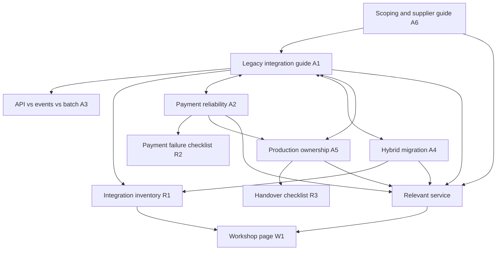

# NMIT content strategy

Prepared 17 September 2026. Planning horizon: 90 days from kickoff.

## Direction and working assumptions

Make integration modernization the central subject, with payment reliability, hybrid cloud, and DevOps explaining how that work gets delivered and maintained. Help an engineering leader make an architecture or supplier decision, then offer a relevant conversation with NMIT.

The working commercial goal is qualified enquiries and integration-workshop bookings. It has not been confirmed with the business. Primary readers are CTOs, heads of engineering, enterprise architects, and integration/platform leads at banks, exchanges, insurers, and fintechs. Procurement and delivery managers are secondary readers. This audience is inferred from the React site's positioning; neither purchasing geography nor deal size is established.

The original site lists API integration, cloud, DevOps, staffing, and a free one-day onsite integration-modernization workshop. This supports a service-led content plan. Confirm the workshop's availability, geography, eligibility, and deliverables before promoting it. [NMIT website](https://nmit-solutions.com/)

Editorial positioning: **Practical architecture guidance for connecting existing systems, managing integration failures, and owning what happens in production.**

Proposed cadence assumes one writer and an engineer available for technical review: six substantial article publications or refreshes over 90 days, three small companion resources, and an updated workshop page. This is a capacity assumption, not NMIT's confirmed staffing. If review capacity is lower, publish the first three articles and their resources before expanding to cloud and DevOps.

No Search Console, analytics, keyword export, customer interviews, sales transcripts, budget, or named competitors were supplied. Candidate queries below are editorial targets, not verified search demand. Priority reflects service fit and the usefulness of the proposed asset; it does not claim measured customer frequency, ranking difficulty, or traffic potential.

## Existing content: keep, improve, defer

Reviewed the React site's `src/data/posts.ts`, service/about/contact pages, workshop component, router, and the original live homepage.

| Existing asset | Finding | Action |
| --- | --- | --- |
| Partner-payment API article | Closest fit to the financial-sector audience; three paragraphs introduce failure handling without a worked example. | Refresh first. Add a state diagram, a timeout/retry scenario, reconciliation decisions, and a checklist. Retain the existing slug. |
| Telecom cloud article | Potentially useful for a telecom audience, which is outside the current site's main sector positioning. Includes an unattributed market forecast. | Defer expansion until telecom is a confirmed target. Verify or remove the forecast in a future edit; substantiate any delivery-experience claims. |
| HP/Qualcomm article | Hardware procurement topic has a weak connection to the main integration offer. | Stop commissioning similar news commentary. Retain pending analytics review; no automatic deletion or redirect. |
| Services page | Explains four capabilities but provides little buying guidance. | Link future articles to the relevant service. Add engagement scope, responsibilities, and handover expectations when operationally confirmed. |
| Workshop/contact flow | Concrete next step, but the React form opens an email draft rather than submitting an enquiry. | Describe that behavior clearly when implemented. Measure draft opens separately from received enquiries and confirmed bookings. |
| About/client proof | Client names and team statistics appear in the site source. No supporting case-study records were supplied. | Verify current figures and permission to use names/logos. Use customer results only when evidence and publication approval exist. |

The current article dates are from 2024. A substantive refresh should show its real updated date while preserving the original publication date. First-person statements such as “most problems we see” need an accountable NMIT author or documented experience, not an assumed company history.

## Audience questions to validate

These are interview hypotheses, not customer quotes:

| Reader and trigger | Proposed question | Asset and next step |
| --- | --- | --- |
| Architect adding a partner or product | Can we expose an existing system without replacing it? | Legacy integration guide → inventory template → API service/workshop |
| Payments lead investigating ambiguous transactions | What do we do when a partner times out after accepting a payment? | Payment guide → failure checklist → scoped API enquiry |
| Platform lead planning a migration | Which dependencies can prevent this workload from moving safely? | Hybrid migration guide → readiness worksheet → cloud enquiry |
| Engineering head inheriting integrations | Who owns incidents, releases, and reconciliation after go-live? | Production-ownership guide → handover checklist → DevOps/staffing enquiry |
| CTO evaluating suppliers | What determines scope, cost, delivery risk, and handover quality? | Supplier/scoping guide → workshop |

During the first week, review up to ten recent enquiry or sales conversations, or interview three customer-facing engineers if records are unavailable. Capture the exact question, role, trigger, objection, source/date, and confidentiality constraints. Use anonymized language only with permission. Repeated themes can then replace these hypotheses.

## Four content pillars

| Pillar | Why it belongs | Clusters | Service connection |
| --- | --- | --- | --- |
| 1. Legacy and enterprise integration | Closest fit to the website's central offer and interactive architecture model. | Interface inventory; ERP/CRM contracts; wrappers vs replacement; API vs events vs batch; incremental migration; ownership boundaries. | API integration; modernization workshop. |
| 2. Reliable partner and payment integration | Gives the financial-sector audience a concrete, consequential problem to evaluate. | Timeouts; idempotency; duplicate/out-of-order events; reconciliation; partner change management; failure testing. | API integration, supported by DevOps. |
| 3. Cloud and hybrid migration | Connects cloud work to the dependencies that remain on existing infrastructure. | Dependency mapping; migration sequencing; connectivity; cutover/rollback; operating cost assumptions; readiness assessment. | Cloud services; integration workshop where relevant. |
| 4. DevOps and production ownership | Explains the operating responsibilities behind integration delivery. | Release safety; logs/metrics/traces; incident ownership; escalation; runbooks; engineering handover; embedded staffing. | DevOps and staffing. |

Start with integration and payments. Cloud and DevOps should extend the same buyer journey rather than turn the blog into a general technology-news feed.

## Adjacent content benchmarks

These are examples of content competing for readers' attention, not confirmed NMIT sales competitors. A limited review cannot establish their traffic, conversion rates, or sitewide gaps.

| Reviewed source | Observed approach | NMIT opportunity, inferred |
| --- | --- | --- |
| [HCLTech: APIs and integration layers in legacy modernization](https://www.hcltech.com/en-us/knowledge-library/role-apis-and-integration-layers-legacy-modernization) | Broad overview covering legacy challenges, API layers, governance, and AI readiness. | Build a narrower decision aid with a worked dependency inventory, explicit tradeoffs, and an engineer-reviewed scope example. |
| [WSO2: Payment modernization](https://wso2.com/solutions/financial-services/payment-modernization/) | Platform-led financial-services solution page with integration and legacy-modernization capabilities. | Explain supplier-independent failure scenarios and operational responsibilities. Avoid assuming NMIT implements WSO2 or particular financial protocols. |
| [AWS: Strangler fig pattern](https://docs.aws.amazon.com/prescriptive-guidance/latest/modernization-decomposing-monoliths/strangler-fig.html) | Pattern guidance explains incremental replacement, routing, benefits, and limitations. | Add a business-facing worksheet for choosing a first boundary and documenting rollback, with a clearly labeled hypothetical example. |

The proposed differentiation is usable decision documents and accountable engineering commentary. Do not claim this is a proven market gap until a broader competitor review and customer research support it.

## Prioritized topics and briefs

P1 means start first; P2 means follow once the main integration cluster exists. “Both” means designed for search discovery and useful sharing inside a buying team. Queries are candidates; validate intent and demand before finalizing titles. All proposed paths are future path-based URLs, not currently implemented routes.

| ID / priority | Title and format | Discovery | Candidate query / buyer stage | Why this topic; evidence and required input | Next step |
| --- | --- | --- | --- | --- | --- |
| A1 / P1 | **Legacy system integration: an architecture guide for ERP, CRM, and partner systems** — hub/use-case guide | Searchable | legacy system integration / awareness–consideration | Matches current API service and hero modules. Explain when to integrate, replace, or leave a system alone; include boundaries, contracts, security, observability, and one hypothetical architecture. NMIT engineer must validate the example. AWS pattern guidance informs the incremental-migration section. | R1 inventory → API service/workshop |
| A2 / P1 | **Partner-payment API integration: timeouts, retries, and reconciliation** — refresh existing article into payment hub | Both | payment API integration / implementation–consideration | Existing source provides topical fit, not verified customer evidence. Walk through lost responses, duplicate submissions, webhook ordering, state lookup, and unresolved transactions. Use provider-specific behavior rather than universal guarantees. [Stripe idempotency documentation](https://docs.stripe.com/api/idempotent_requests) is one implementation reference, not proof of NMIT's stack. | R2 failure checklist → API enquiry |
| R1 / P1 | **Integration inventory template: systems, contracts, dependencies, and owners** — accessible worksheet | Both | system integration checklist / implementation | Companion to A1 and workshop preparation. Fields: system, owner, interface, business flow, data sensitivity, frequency, dependencies, failure behavior, and known documentation gaps. Include one fictional completed row. | A1 → workshop |
| A3 / P1 | **APIs, events, or batch: choosing an integration pattern** — comparison/spoke | Searchable | API vs event driven integration / consideration | Helps the architect decide rather than promoting one pattern universally. Compare latency, coupling, delivery guarantees, ordering, freshness, and operating burden. Cross-link A1 and A2; engineer reviews constraints. Customer relevance remains a hypothesis. | A1/R1 → API service |
| R2 / P1 | **Partner-payment failure test checklist** — implementation resource | Both | payment API testing checklist / implementation | Turns A2 into an actionable review: repeated requests, delayed/lost responses, duplicate callbacks, partner outage, reconciliation mismatch, key retention, and escalation. Document expected results and evidence; do not promise exactly-once settlement from idempotency alone. | A2 → API enquiry |
| W1 / P1 | **Integration modernization workshop: agenda, preparation, and deliverables** — decision page update | Searchable | integration modernization workshop / decision | Original site establishes the offer. Confirm practical terms, attendees, data needed, boundaries of review, follow-up, and what a written recommendation actually includes. Customer objections are not yet known. | Workshop enquiry |
| A4 / P2 | **Hybrid cloud migration: map integration dependencies before cutover** — cloud hub/use-case guide | Searchable | hybrid cloud migration checklist / consideration–implementation | Matches cloud and integration services. Cover dependency inventory, identity/network assumptions, data flows, sequencing, testing, cutover, rollback, and ownership. Use a hypothetical migration; NMIT cloud reviewer supplies supported platform details. | R1 → cloud enquiry |
| A5 / P2 | **Production-ready integrations: monitoring, incident ownership, and handover** — DevOps hub | Both | API integration monitoring / implementation–consideration | Matches DevOps/staffing offer and A2's ownership theme. Specify signals, business-state checks, alerts, escalation, runbooks, release responsibility, and handover acceptance. NMIT reviewer must confirm any offered support model. | R3 → DevOps enquiry |
| R3 / P2 | **Integration handover checklist: what the receiving team needs** — template/spoke | Both | API integration handover checklist / implementation | Companion to A5: contracts, dependencies, dashboards, credentials process, runbooks, failure states, deployment/rollback, and named owners. Publish an empty checklist and a clearly fictional example. | A5 → DevOps/staffing enquiry |
| A6 / P2 | **How to scope an API integration project and evaluate a delivery partner** — buying guide | Searchable | API integration project cost / decision | Supports commercial intent without inventing prices. Explain scope drivers: interface count/complexity, documentation, test access, data mapping, failure handling, security review, environments, and handover. Include supplier questions and explicit estimate assumptions. Sales/engineering must supply NMIT's actual engagement process. | Services → workshop or scoped enquiry |

Deferred spokes: incremental ERP modernization; partner API version changes; cloud cutover worksheet; build internally vs embedded integration engineers. A customer case study is conditional on a real approved project record, including baseline, scope, measurement period, outcome, and limitations. No fabricated case studies or anonymous performance numbers.

### First article acceptance brief: A1

**Reader outcome:** identify integration boundaries and produce an initial inventory suitable for an architecture discussion.

**Proposed path:** `/blog/legacy-system-integration`. Answer the main question in the opening paragraph. Then cover: when integration makes sense; inventory and dependency mapping; pattern choice; a labeled fictional before/after diagram; incremental rollout and rollback; security and operating ownership; scoping questions; relevant FAQs; R1 and workshop next steps.

The diagram should show ERP, CRM, and a partner workflow, with contracts and ownership labels. A shared integration layer is a logical architecture choice, not a claim that every client needs one central server. Discuss failure domains and distributed deployment tradeoffs. Cite primary technical documentation beside the relevant claim. Add a named author, technical reviewer, actual publication/update dates, and an explanatory diagram alternative in HTML.

## Topic cluster and internal-link map

All articles can live under `/blog`. Resources can live under `/resources`; these paths are proposed. The hub is an article, not a new navigation hierarchy.

Each spoke links back to its hub; each hub links to published spokes and the relevant service. Resource pages link to their explanatory article. Add only useful contextual links, not every asset to every page. Keep the payment article's existing slug when refreshing; avoid duplicate pages targeting the same question.

## 90-day execution and distribution

The companion [editorial calendar](./editorial-calendar.csv) assigns relative weeks and publication targets. Week 1 is research and publishing preparation. Weeks 2–6 build integration/payments; weeks 7–12 extend cloud/DevOps and commercial guidance. Week 13 reviews evidence and chooses the next quarter. A technical-readiness delay should move search publication dates, not force incomplete content live.

For each major article, produce one useful diagram or decision table and two short LinkedIn adaptations: a specific engineering question and a practical checklist excerpt. Link to the full resource with campaign parameters. Offer the article to sales for relevant follow-up. Posting or sending messages remains a separate publishing action; this plan sends none.

Resources should be usable without a form initially. Readers can inspect NMIT's reasoning before choosing to enquire. Keep an optional workshop CTA beside the resource, with a secondary relevant service link. On decision content, lead with scope/process information rather than generic technology claims.

## Publishing preparation

The local React app uses `HashRouter`, creating URLs such as `/#/blog/partner-payment-apis`. Google advises using the History API rather than fragments for loading different page content and recommends server-side or pre-rendering. Before relying on organic acquisition, implement path-based routes with hosting support, accessible article HTML, and stable page URLs. This is a future implementation task, not a change made by this strategy. [Google JavaScript SEO guidance](https://developers.google.com/search/docs/crawling-indexing/javascript/javascript-seo-basics)

Also prepare unique article titles/descriptions, canonical URLs, crawlable internal links, a sitemap of public paths, appropriate not-found behavior, and per-page social previews. Preserve known existing URLs where possible and plan migration handling with the hosting environment. If technical changes are delayed, drafted articles and resources can still support sales conversations, but search results should not be assumed.

Keep the site's minimal design: readable article width, clear headings, restrained callouts, real diagrams, and a concise resource preview. Use the approved NMIT PNG branding. Add factual content in ordinary HTML; the interactive 3D hero must not be the only explanation of the service.

## Measurement and decision rules

Set a baseline before launching. Do not forecast traffic or bookings without historical data.

| Measure | Definition | Review |
| --- | --- | --- |
| Publishing readiness | Public path loads directly; visible article content, correct canonical, unique metadata, crawlable links, and confirmed enquiry behavior. | Before each publication |
| Organic discovery | Search Console impressions/clicks by article and non-branded query cluster; indexation checked separately. | Monthly after launch |
| Content → service interest | Relevant service-link clicks divided by measured article sessions. | Monthly; identify low-volume samples |
| Content → enquiry intent | Workshop/contact CTA clicks and email-draft opens, reported separately. | Monthly |
| Received qualified enquiries | Received messages with a matching business need, relevant buyer/team, and an agreed next step. Confirm definition with sales. | Weekly manual log or CRM |
| Workshop conversion | Confirmed bookings divided by received workshop enquiries; track attended workshops separately. | Monthly |
| Commercial contribution | Qualified opportunities with a recorded content touch and agreed attribution window. Association is not proof of causation. | Quarterly |

Record content ID, landing page, source/medium, campaign, enquiry date, qualification, next step, and opportunity status. Avoid sensitive data in event names or URLs. The current mailto action does not establish that a message was sent; received enquiries need inbox/CRM reconciliation. When a backend form exists, distinguish submission attempts, accepted submissions, and actual qualified leads.

For the 90-day cycle, commit to controllable outputs: six reviewed article publications/refreshes, three usable resources, a confirmed workshop explanation, and monthly measurement reviews. Set commercial targets only after establishing the baseline and sales capacity.

At day 90, strengthen topics that attract relevant queries and qualified conversations. Where impressions exist but clicks lag, examine search intent and presentation. Where readers visit but do not progress, review relevance, proof, and CTA clarity. Low-volume data is inconclusive; do not delete an asset solely because it has no early bookings.

## Inputs needed to sharpen the next version

1. Primary buying geography, ideal project size, and highest-priority service.
2. Recent buyer questions, objections, and which roles approve engagements.
3. Search Console/analytics exports and any content-attributed enquiries.
4. Actual competing suppliers mentioned in sales conversations.
5. Available engineer reviewers, writer capacity, and approved customer evidence.
6. Current workshop terms, support commitments, and enquiry-handling process.

Until those inputs arrive, this remains a practical first plan based on website/source review and a limited set of public content benchmarks.
